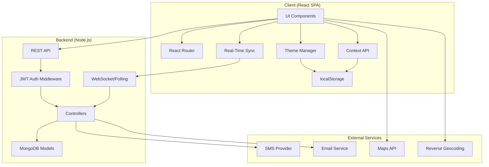
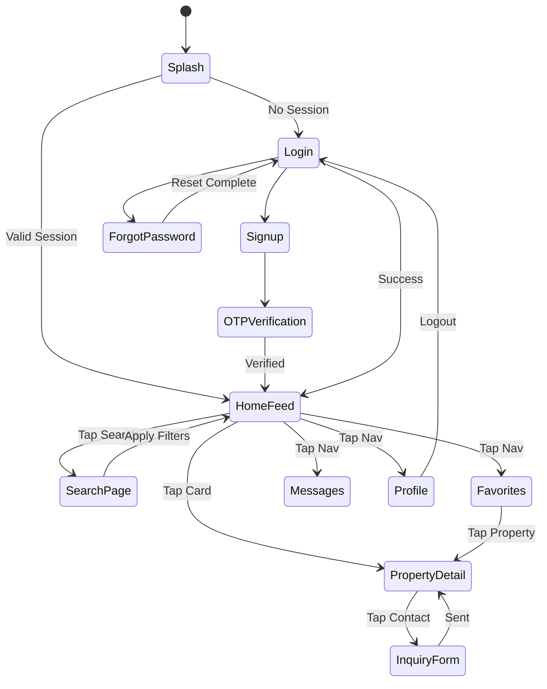

# Design Document: INZU Property Rental Platform

## Overview

INZU is a mobile-first property rental web application built with React, React Router, and a Node.js backend. The architecture follows a client-server model with JWT-based authentication, RESTful API communication, and MongoDB for data persistence. The frontend emphasizes responsive design, optimistic UI updates, and progressive web app (PWA) capabilities for offline support.

The system is organized into distinct layers:
- **Presentation Layer**: React components with mobile-first responsive design
- **State Management Layer**: React Context API for global state (authentication, favorites)
- **API Layer**: RESTful endpoints for CRUD operations on users, properties, inquiries, and favorites
- **Data Layer**: MongoDB collections for persistent storage
- **Authentication Layer**: JWT tokens with localStorage persistence

## Architecture

### High-Level Architecture



### Technology Stack

**Frontend:**
- React 19.2.0 with React Router 7.13.0 for navigation
- Lucide React for icons
- Vite for build tooling and development server
- PWA support via vite-plugin-pwa and Workbox

**Backend:**
- Node.js with Express.js
- MongoDB 7.1.0 for database
- JWT for authentication tokens
- Nodemailer or Twilio for OTP delivery

**Deployment:**
- Frontend: Static hosting (Vercel, Netlify, or similar)
- Backend: Node.js hosting (Railway, Render, or similar)
- Database: MongoDB Atlas

### Navigation Flow



## Components and Interfaces

### Frontend Components

#### 1. SplashScreen Component
**Purpose:** Display branding with animation and handle initial session check

**Props:** None

**State:**
- `isLoading: boolean` - indicates session check in progress
- `animationComplete: boolean` - tracks animation state

**Behavior:**
- On mount, display INZU logo with fade-in animation
- Show tagline "Find your dream property in Rwanda" with slide-up animation
- Display loading spinner during session check
- Check localStorage for `authToken`
- If token exists, validate with backend `/api/auth/verify`
- Navigate to `/home` if valid, `/login` if invalid or missing
- Minimum display time: 2 seconds for branding visibility

#### 2. AuthContext Provider
**Purpose:** Manage global authentication state

**State:**
- `user: User | null` - current authenticated user
- `token: string | null` - JWT token
- `isAuthenticated: boolean` - authentication status

**Methods:**
- `login(email: string, password: string): Promise<void>` - authenticate user
- `signup(data: SignupData): Promise<void>` - register new user
- `logout(): void` - clear session
- `verifyOTP(otp: string): Promise<void>` - verify account
- `updateProfile(data: ProfileData): Promise<void>` - update user info

#### 3. Login Component
**Purpose:** User authentication form

**State:**
- `email: string` - user email or phone
- `password: string` - user password
- `error: string | null` - validation or auth error

**Behavior:**
- Validate non-empty fields
- Call `AuthContext.login()` on submit
- Navigate to `/home` on success
- Display error message on failure

#### 4. Signup Component
**Purpose:** New user registration form

**State:**
- `name: string`
- `email: string`
- `phone: string`
- `password: string`
- `acceptedTerms: boolean`
- `error: string | null`

**Behavior:**
- Validate all required fields
- Ensure `acceptedTerms` is true
- Call `AuthContext.signup()` on submit
- Navigate to `/verify-otp` on success

#### 5. OTPVerification Component
**Purpose:** Verify user account via OTP

**State:**
- `otp: string` - 6-digit code
- `error: string | null`

**Behavior:**
- Accept 6-digit numeric input
- Call `AuthContext.verifyOTP()` on submit
- Navigate to `/home` on success
- Allow resend OTP after 60 seconds

#### 6. HomeFeed Component
**Purpose:** Display scrollable list of property listings

**State:**
- `properties: Property[]` - current listings
- `filters: FilterState` - active search filters
- `page: number` - pagination cursor
- `hasMore: boolean` - more results available
- `loading: boolean`

**Behavior:**
- Fetch properties from `/api/properties?page={page}&filters={filters}`
- Implement infinite scroll with Intersection Observer
- Update on filter changes
- Navigate to `/property/:id` on card tap
- Toggle favorite via `FavoritesContext`

#### 7. PropertyCard Component
**Purpose:** Display property summary in feed

**Props:**
- `property: Property` - property data
- `onTap: () => void` - navigation handler
- `onFavorite: () => void` - favorite toggle handler

**Rendering:**
- Display first image from `property.images`
- Show `property.price`, `property.location`, `property.type`
- Heart icon with filled state if favorited
- Lazy load image when in viewport

#### 8. SearchFilter Component
**Purpose:** Advanced property filtering interface

**State:**
- `location: string`
- `priceRange: [number, number]`
- `propertyType: 'Apartment' | 'House' | 'Land' | null`
- `bedrooms: number | null`
- `bathrooms: number | null`
- `furnished: boolean`
- `petFriendly: boolean`

**Behavior:**
- Update filters in real-time
- Emit filter changes to parent (HomeFeed)
- Persist filters in sessionStorage
- Clear all filters button

#### 9. PropertyDetail Component
**Purpose:** Display full property information

**State:**
- `property: Property | null` - detailed property data
- `currentImageIndex: number` - carousel position
- `isFavorited: boolean`

**Behavior:**
- Fetch property from `/api/properties/:id`
- Implement image carousel with swipe gestures
- Toggle favorite state
- Open inquiry form modal
- Open device maps with property coordinates

#### 10. InquiryForm Component
**Purpose:** Send message to property owner

**State:**
- `name: string`
- `email: string`
- `phone: string`
- `message: string`
- `errors: Record<string, string>`

**Behavior:**
- Validate all fields non-empty
- Validate email format
- POST to `/api/inquiries` with property ID
- Display success toast on completion
- Close modal after success

#### 11. Favorites Component
**Purpose:** Display saved properties

**State:**
- `favorites: Property[]` - user's saved properties

**Behavior:**
- Fetch from `/api/favorites`
- Display as grid of PropertyCards
- Remove favorite on heart tap
- Navigate to detail on card tap

#### 12. Profile Component
**Purpose:** User account management

**State:**
- `name: string`
- `email: string`
- `phone: string`
- `currentPassword: string`
- `newPassword: string`
- `preferences: UserPreferences`

**Behavior:**
- Display current user info
- Update profile via `/api/users/profile`
- Change password via `/api/users/password`
- Update preferences locally and sync
- Logout button calls `AuthContext.logout()`

#### 13. BottomNavigation Component
**Purpose:** Persistent navigation bar

**Props:**
- `currentRoute: string` - active tab indicator
- `unreadCount: number` - unread messages count

**Behavior:**
- Render 5 tabs: Home, Search, Favorites, Messages, Profile
- Display unread count badge on Messages tab when > 0
- Highlight active tab
- Navigate via React Router on tap
- Fixed position at bottom of viewport

#### 14. ThemeToggle Component
**Purpose:** Switch between light and dark themes

**Props:** None

**State:**
- `theme: 'light' | 'dark'` - current theme

**Behavior:**
- Load theme preference from localStorage on mount
- Toggle between light and dark themes
- Apply theme CSS variables to document root
- Persist theme preference to localStorage and backend
- Update all components in real-time

#### 15. Messages Component
**Purpose:** Display conversation threads and messaging interface

**State:**
- `conversations: Conversation[]` - list of message threads
- `activeConversation: Conversation | null` - currently open chat
- `messageInput: string` - current message text
- `isRecording: boolean` - voice note recording state
- `showEmojiPicker: boolean` - emoji picker visibility

**Behavior:**
- Fetch conversations from `/api/messages/conversations`
- Display unread count badge on conversations with unread messages
- Open conversation on tap
- Display messages with sent (right) and received (left) alignment
- Show "seen" status indicator on sent messages
- Display reply indicators for message replies (Instagram-style)
- Record voice notes on mic button press
- Send voice note immediately on release
- Display emoji picker on emoji button tap
- Insert emoji into message input on selection
- Update conversations in real-time via WebSocket or polling
- Mark messages as read when conversation is opened

#### 16. EmojiPicker Component
**Purpose:** Emoji selection interface for messages

**Props:**
- `onEmojiSelect: (emoji: string) => void` - callback for emoji selection
- `onClose: () => void` - close picker callback

**Behavior:**
- Display grid of common emojis
- Categorize emojis (smileys, objects, symbols, etc.)
- Search functionality for finding emojis
- Insert selected emoji into message input
- Close on outside click or close button

#### 17. PropertyReview Component
**Purpose:** Display and submit property reviews

**Props:**
- `propertyId: string` - property being reviewed
- `existingReview: Review | null` - user's existing review if any

**State:**
- `rating: number` - star rating (1-5)
- `comment: string` - review text
- `reviews: Review[]` - all property reviews

**Behavior:**
- Fetch reviews from `/api/properties/:id/reviews`
- Display average rating and review count
- Show all reviews with reviewer name, rating, comment, date
- Allow user to submit new review with 5-star selector
- Validate rating is between 1-5 stars
- POST review to `/api/reviews`
- Update average rating after submission
- Allow editing existing review

#### 18. RoomDescriptionInput Component
**Purpose:** Add room descriptions during property upload

**Props:**
- `onChange: (rooms: RoomDescription[]) => void` - callback for room updates

**State:**
- `rooms: RoomDescription[]` - list of room descriptions

**Behavior:**
- Display list of room description inputs
- Allow adding new room with type selector (bedroom, bathroom, kitchen, living room)
- Text area for room description
- Remove room button for each entry
- Validate at least one room description provided
- Pass room data to parent component

#### 19. TermsAndConditions Component
**Purpose:** Display platform terms and conditions

**Props:** None

**State:**
- `termsContent: string` - terms text content

**Behavior:**
- Display full terms and conditions text
- Scrollable content area
- Back button to return to previous screen
- Link from Settings and Signup screens

#### 20. SearchBar Component (Enhanced)
**Purpose:** Global search functionality across all screens

**Props:**
- `onSearch: (query: string) => void` - search callback
- `placeholder: string` - input placeholder text

**State:**
- `searchQuery: string` - current search text

**Behavior:**
- Display search input on all main screens
- Trigger search on text input (debounced)
- Filter properties by location matching query
- Clear search button when query is not empty
- Persist search query in sessionStorage
- Work consistently across Home, Houses, Rooms, Apartments, Hotels pages

#### 21. LocationTracker Component
**Purpose:** Track user's district-level location for "Near me" feature

**Props:** None

**State:**
- `userDistrict: string | null` - user's current district
- `permissionGranted: boolean` - location permission status

**Behavior:**
- Request geolocation permission on mount
- Fetch user's coordinates via browser Geolocation API
- Reverse geocode coordinates to district name (not GPS coordinates)
- Store district in context for filtering
- Display "Near me" filter option when district available
- Filter properties by matching district when "Near me" active

### Backend API Endpoints

#### Authentication Endpoints

**POST /api/auth/signup**
- Body: `{ name, email, phone, password }`
- Response: `{ message: "OTP sent", userId }`
- Behavior: Create user, send OTP, return user ID

**POST /api/auth/verify-otp**
- Body: `{ userId, otp }`
- Response: `{ token, user }`
- Behavior: Verify OTP, mark user verified, return JWT

**POST /api/auth/login**
- Body: `{ email, password }`
- Response: `{ token, user }`
- Behavior: Validate credentials, return JWT

**POST /api/auth/forgot-password**
- Body: `{ email }`
- Response: `{ message: "OTP sent" }`
- Behavior: Send password reset OTP

**POST /api/auth/reset-password**
- Body: `{ email, otp, newPassword }`
- Response: `{ message: "Password updated" }`
- Behavior: Verify OTP, update password

**GET /api/auth/verify**
- Headers: `Authorization: Bearer {token}`
- Response: `{ user }`
- Behavior: Validate JWT, return user data

#### Property Endpoints

**GET /api/properties**
- Query: `page, limit, location, priceMin, priceMax, type, bedrooms, bathrooms, furnished, petFriendly, lat, lng`
- Response: `{ properties: Property[], hasMore: boolean }`
- Behavior: Return filtered properties, prioritize by geolocation if provided

**GET /api/properties/:id**
- Response: `{ property: Property }`
- Behavior: Return detailed property data

**POST /api/properties** (Owner only)
- Body: `{ title, description, price, location, type, bedrooms, bathrooms, amenities, images, coordinates }`
- Response: `{ property: Property }`
- Behavior: Create new property listing

#### Favorites Endpoints

**GET /api/favorites**
- Headers: `Authorization: Bearer {token}`
- Response: `{ favorites: Property[] }`
- Behavior: Return user's saved properties

**POST /api/favorites/:propertyId**
- Headers: `Authorization: Bearer {token}`
- Response: `{ message: "Added to favorites" }`
- Behavior: Add property to user's favorites

**DELETE /api/favorites/:propertyId**
- Headers: `Authorization: Bearer {token}`
- Response: `{ message: "Removed from favorites" }`
- Behavior: Remove property from favorites

#### Inquiry Endpoints

**POST /api/inquiries**
- Headers: `Authorization: Bearer {token}`
- Body: `{ propertyId, name, email, phone, message }`
- Response: `{ inquiry: Inquiry }`
- Behavior: Create inquiry, notify property owner

**GET /api/inquiries**
- Headers: `Authorization: Bearer {token}`
- Response: `{ inquiries: Inquiry[] }`
- Behavior: Return user's inquiry history

#### User Endpoints

**GET /api/users/profile**
- Headers: `Authorization: Bearer {token}`
- Response: `{ user: User }`
- Behavior: Return current user profile

**PUT /api/users/profile**
- Headers: `Authorization: Bearer {token}`
- Body: `{ name, email, phone, preferences }`
- Response: `{ user: User }`
- Behavior: Update user profile

**PUT /api/users/password**
- Headers: `Authorization: Bearer {token}`
- Body: `{ currentPassword, newPassword }`
- Response: `{ message: "Password updated" }`
- Behavior: Verify current password, update to new password

**DELETE /api/users/account**
- Headers: `Authorization: Bearer {token}`
- Body: `{ password }` - confirmation password
- Response: `{ message: "Account deleted" }`
- Behavior: Verify password, delete user account and all associated data (favorites, inquiries, notifications)

#### Review Endpoints

**GET /api/properties/:id/reviews**
- Response: `{ reviews: Review[], averageRating: number, totalReviews: number }`
- Behavior: Return all reviews for a property with aggregate statistics

**POST /api/reviews**
- Headers: `Authorization: Bearer {token}`
- Body: `{ propertyId, rating, comment }`
- Response: `{ review: Review }`
- Behavior: Create new review, update property average rating

**PUT /api/reviews/:id**
- Headers: `Authorization: Bearer {token}`
- Body: `{ rating, comment }`
- Response: `{ review: Review }`
- Behavior: Update existing review, recalculate property average rating

**GET /api/reviews/user/:userId**
- Response: `{ reviews: Review[] }`
- Behavior: Return all reviews submitted by a user

#### Message Endpoints

**GET /api/messages/conversations**
- Headers: `Authorization: Bearer {token}`
- Response: `{ conversations: Conversation[] }`
- Behavior: Return all conversation threads with unread count and last message

**GET /api/messages/:conversationId**
- Headers: `Authorization: Bearer {token}`
- Response: `{ messages: Message[] }`
- Behavior: Return all messages in a conversation, mark as read

**POST /api/messages**
- Headers: `Authorization: Bearer {token}`
- Body: `{ conversationId, text, replyToId? }`
- Response: `{ message: Message }`
- Behavior: Send text message, optionally as reply to another message

**POST /api/messages/voice**
- Headers: `Authorization: Bearer {token}`
- Body: FormData with `audio` file, `conversationId`, `replyToId?`
- Response: `{ message: Message }`
- Behavior: Upload and send voice note message

**PUT /api/messages/:id/seen**
- Headers: `Authorization: Bearer {token}`
- Response: `{ message: "Marked as seen" }`
- Behavior: Mark message as seen by recipient

**GET /api/messages/unread-count**
- Headers: `Authorization: Bearer {token}`
- Response: `{ unreadCount: number }`
- Behavior: Return total unread message count across all conversations

## Data Models

### User Model

```typescript
interface User {
  _id: string
  name: string
  email: string
  phone: string
  password: string // hashed with bcrypt
  isVerified: boolean
  otp: string | null
  otpExpiry: Date | null
  preferences: {
    notifications: boolean
    theme: 'light' | 'dark'
  }
  district: string | null // User's current district for location-based filtering
  createdAt: Date
  updatedAt: Date
}
```

### Property Model

```typescript
interface Property {
  _id: string
  ownerId: string
  title: string
  description: string
  price: number
  location: string
  district: string // Rwanda district for location filtering
  coordinates: {
    lat: number
    lng: number
  }
  type: 'Apartment' | 'House' | 'Land' | 'Hotel'
  listingType: 'rent' | 'sale'
  bedrooms: number
  bathrooms: number
  amenities: string[]
  images: string[] // URLs
  furnished: boolean
  petFriendly: boolean
  status: 'available' | 'rented' | 'sold'
  roomDescriptions: RoomDescription[]
  averageRating: number
  totalReviews: number
  createdAt: Date
  updatedAt: Date
}

interface RoomDescription {
  type: 'bedroom' | 'bathroom' | 'kitchen' | 'living room' | 'other'
  description: string
}
```

### Favorite Model

```typescript
interface Favorite {
  _id: string
  userId: string
  propertyId: string
  createdAt: Date
}
```

### Inquiry Model

```typescript
interface Inquiry {
  _id: string
  propertyId: string
  userId: string
  name: string
  email: string
  phone: string
  message: string
  status: 'pending' | 'replied' | 'closed'
  createdAt: Date
}
```

### Notification Model

```typescript
interface Notification {
  _id: string
  userId: string
  type: 'new_listing' | 'inquiry_reply'
  title: string
  message: string
  relatedId: string // property or inquiry ID
  read: boolean
  createdAt: Date
}
```

### Review Model

```typescript
interface Review {
  _id: string
  propertyId: string
  userId: string
  userName: string
  rating: number // 1-5 stars
  comment: string
  createdAt: Date
  updatedAt: Date
}
```

### Message Model

```typescript
interface Message {
  _id: string
  conversationId: string
  senderId: string
  recipientId: string
  text: string | null
  voiceNote: string | null // URL to audio file
  replyToId: string | null // ID of message being replied to
  seen: boolean
  seenAt: Date | null
  createdAt: Date
}
```

### Conversation Model

```typescript
interface Conversation {
  _id: string
  participants: string[] // Array of user IDs
  propertyId: string // Related property
  lastMessage: Message
  unreadCount: number // Unread messages for current user
  createdAt: Date
  updatedAt: Date
}
```


## Correctness Properties

A property is a characteristic or behavior that should hold true across all valid executions of a system—essentially, a formal statement about what the system should do. Properties serve as the bridge between human-readable specifications and machine-verifiable correctness guarantees.

### Property 1: Session Token Round-Trip
*For any* valid user credentials, logging in should store a session token in localStorage, and that token should allow access to authenticated features until logout clears it.
**Validates: Requirements 1.2, 1.3, 3.2, 3.6, 11.1**

### Property 2: Unauthenticated Navigation
*For any* user without a valid session token (missing, invalid, or expired), attempting to access authenticated routes should redirect to the Login screen.
**Validates: Requirements 1.4, 1.5**

### Property 3: OTP Verification Round-Trip
*For any* valid signup data, creating an account should generate an OTP, and submitting the correct OTP should mark the account as verified and create a session.
**Validates: Requirements 2.3, 2.5**

### Property 4: Form Validation Rejects Empty Fields
*For any* form (signup, inquiry, profile update) with required fields, submitting with one or more empty fields should prevent submission and display validation errors.
**Validates: Requirements 2.2, 9.2, 10.2**

### Property 5: Unverified Account Access Prevention
*For any* user account that has not completed OTP verification, attempting to access authenticated features should be blocked.
**Validates: Requirements 2.7**

### Property 6: Password Reset Round-Trip
*For any* registered user email, initiating password reset should send an OTP, and submitting the correct OTP with a new password should update the user's password.
**Validates: Requirements 4.2, 4.4**

### Property 7: Property Listing Display Completeness
*For any* property returned by the API, the property card should display all required fields (image, price, location, type), and the detail view should display all fields (images, price, location, type, description, amenities).
**Validates: Requirements 5.3, 7.1**

### Property 8: Infinite Scroll Pagination
*For any* feed with more properties than the initial page size, scrolling to the bottom should trigger loading of additional properties, and the total displayed should increase.
**Validates: Requirements 5.4**

### Property 9: Property Navigation
*For any* property card (in feed, favorites, or search results), tapping the card should navigate to the Property Detail screen with the correct property ID.
**Validates: Requirements 5.6, 8.7**

### Property 10: Favorite State Consistency
*For any* property, toggling the favorite icon should immediately update the UI state, sync with the backend API, and persist across app sessions.
**Validates: Requirements 5.7, 7.3, 8.1, 8.4, 8.5**

### Property 11: Favorite Add-Remove Round-Trip
*For any* property, adding it to favorites then removing it should return the favorites list to its original state.
**Validates: Requirements 8.1, 8.2**

### Property 12: Offline Favorites Synchronization
*For any* favorite changes made while offline, the changes should be cached locally and synchronized with the backend when connection is restored.
**Validates: Requirements 8.6**

### Property 13: Search Filter Application
*For any* search query entered in the search bar, the displayed properties should only include those whose location matches the query.
**Validates: Requirements 6.1**

### Property 14: Multiple Filter Combination (AND Logic)
*For any* combination of active filters (type, price range, bedrooms, bathrooms, amenities), the displayed properties should satisfy ALL active filter criteria simultaneously.
**Validates: Requirements 6.2, 6.3, 6.4, 6.5, 6.6**

### Property 15: Filter Real-Time Update
*For any* filter change, the property feed should update immediately without requiring manual refresh.
**Validates: Requirements 6.7**

### Property 16: Filter Clear Reset
*For any* set of active filters, clearing all filters should display all available properties without any filtering applied.
**Validates: Requirements 6.8**

### Property 17: Image Carousel Navigation
*For any* property with multiple images, swiping the carousel should cycle through images in order, and the displayed image index should update correctly.
**Validates: Requirements 7.2**

### Property 18: Inquiry Submission Round-Trip
*For any* valid inquiry form data (non-empty name, email, phone, message), submitting the inquiry should send it to the backend, display a success confirmation, and optionally store it in inquiry history.
**Validates: Requirements 9.3, 9.4, 9.6**

### Property 19: Profile Update Round-Trip
*For any* valid profile updates (name, email, phone, preferences), submitting changes should sync with the backend and reflect in the displayed profile data.
**Validates: Requirements 10.1, 10.3, 10.6**

### Property 20: Password Change Verification
*For any* password change request, the system should require the current password for verification before allowing the update.
**Validates: Requirements 10.4, 10.5**

### Property 21: Logout Session Cleanup
*For any* authenticated user, logging out should clear the session token from localStorage, clear cached user data from memory, and redirect to the Login screen.
**Validates: Requirements 11.1, 11.2, 11.3**

### Property 22: Notification Matching and Storage
*For any* new property listing that matches a user's saved search criteria, a notification should be generated, stored in the notification center, and sent as a push notification if enabled.
**Validates: Requirements 12.1, 12.3**

### Property 23: Notification Navigation
*For any* notification, tapping it should navigate to the relevant screen (property detail for new listings, inquiry thread for replies).
**Validates: Requirements 12.4**

### Property 24: Notification Preference Enforcement
*For any* user who has disabled notifications in preferences, no push notifications should be sent, but notifications should still be stored in the notification center.
**Validates: Requirements 12.5**

### Property 25: Bottom Navigation State Preservation
*For any* screen switch via bottom navigation, the previous screen's state (scroll position, applied filters) should be preserved when navigating back.
**Validates: Requirements 13.3**

### Property 26: Form Validation Error Highlighting
*For any* invalid form submission, all fields with missing or invalid data should be visually highlighted with specific error messages.
**Validates: Requirements 14.3**

### Property 27: Profile Completeness Validation
*For any* user profile with empty required fields, the system should prompt the user to complete their profile before allowing certain actions.
**Validates: Requirements 14.5**

### Property 28: Lazy Image Loading
*For any* property image in the feed, the image should only be loaded when it enters the viewport (becomes visible to the user).
**Validates: Requirements 15.1**

### Property 29: Optimistic UI Updates
*For any* favorite toggle action, the UI should update immediately (optimistically) before the backend API confirms the change.
**Validates: Requirements 15.2**

### Property 30: Responsive Layout Scaling
*For any* viewport size, property cards and images should scale appropriately to fit the screen without breaking layout.
**Validates: Requirements 15.3**

### Property 31: Geolocation-Based Sorting
*For any* property listings fetched with user geolocation coordinates, properties should be sorted by distance from the user's location (closest first).
**Validates: Requirements 16.2, 16.3**

### Property 32: Theme Persistence and Application
*For any* theme selection (light or dark), the theme should be applied immediately to all screens, persisted in localStorage, and loaded on app launch.
**Validates: Requirements 17.1, 17.2, 17.3, 17.4, 17.5**

### Property 33: Message Seen Status Tracking
*For any* message sent, when the recipient opens the conversation, the message should be marked as seen and display a seen indicator to the sender.
**Validates: Requirements 18.4**

### Property 34: Unread Message Count Accuracy
*For any* conversation with unread messages, the unread count badge should accurately reflect the number of unread messages and update in real-time.
**Validates: Requirements 18.2, 18.8**

### Property 35: Voice Note Immediate Send
*For any* voice note recording, releasing the record button should immediately send the voice note without additional confirmation.
**Validates: Requirements 18.9, 18.10**

### Property 36: Emoji Insertion
*For any* emoji selected from the picker, the emoji should be inserted at the cursor position in the message input field.
**Validates: Requirements 18.6, 18.7**

### Property 37: Review Rating Validation
*For any* review submission, the system should require a rating between 1 and 5 stars and update the property's average rating correctly.
**Validates: Requirements 19.3, 19.4, 19.5**

### Property 38: Room Description Requirement
*For any* property upload, at least one room description must be provided before the property can be saved.
**Validates: Requirements 20.1, 20.3, 20.4**

### Property 39: Real-Time Property Updates
*For any* new property added to the system, the Home Feed should update in real-time without requiring a page refresh.
**Validates: Requirements 21.1, 21.4**

### Property 40: Account Deletion Completeness
*For any* account deletion, all associated user data (favorites, inquiries, notifications, reviews) should be permanently deleted.
**Validates: Requirements 11.6, 11.7**

### Property 41: District-Level Location Filtering
*For any* "Near me" filter activation, properties should be filtered by matching the user's district (not GPS coordinates).
**Validates: Requirements 6.6, 16.2, 16.3**

### Property 42: Global Search Consistency
*For any* search query entered on any screen (Home, Houses, Rooms, Apartments, Hotels), the search should filter properties consistently by location.
**Validates: Requirements 6.1**

### Property 43: Message Reply Indicator
*For any* message sent as a reply, the message should display a reply indicator showing which message it's replying to (Instagram-style).
**Validates: Requirements 18.5**

## Error Handling

### Real-Time Update Handling

**WebSocket Connection Failure:**
- Fallback: Use polling mechanism (every 30 seconds)
- Display: Connection status indicator
- Retry: Exponential backoff for reconnection attempts

**Message Sync Conflicts:**
- Resolution: Server timestamp as source of truth
- Display: Reload conversation if conflict detected
- Logging: Track sync conflicts for monitoring

**Voice Note Upload Failure:**
- Display: "Failed to send voice note. Retry?"
- Action: Retry button with cached audio blob
- Fallback: Convert to text message option

### Theme Application Errors

**Theme Load Failure:**
- Fallback: Default to light theme
- Display: No error message (silent fallback)
- Logging: Log theme load failures

**CSS Variable Application:**
- Fallback: Inline styles if CSS variables unsupported
- Compatibility: Check browser support on mount

### Review Submission Errors

**Duplicate Review:**
- Display: "You've already reviewed this property. Edit your existing review?"
- Action: Navigate to edit review form

**Invalid Rating:**
- Display: "Please select a rating between 1 and 5 stars"
- Prevent: Form submission until valid rating selected

### Location Tracking Errors

**Geolocation Permission Denied:**
- Display: "Enable location to see properties near you"
- Fallback: Show all properties without district filtering
- Action: Manual district selection option

**Reverse Geocoding Failure:**
- Fallback: Use coordinates without district name
- Display: Location as coordinates
- Retry: Automatic retry once after 5 seconds

### Authentication Errors

**Invalid Credentials:**
- Display: "Invalid email/phone or password"
- Action: Allow retry, offer "Forgot Password" link
- Logging: Log failed login attempts for security monitoring

**Expired Session:**
- Clear localStorage token
- Redirect to Login screen
- Display: "Your session has expired. Please log in again."

**OTP Verification Failures:**
- Display: "Invalid OTP. Please try again."
- Allow: Resend OTP after 60-second cooldown
- Limit: Maximum 5 attempts before requiring new signup/reset

**Unverified Account Access:**
- Block: All authenticated routes
- Display: "Please verify your account to continue"
- Redirect: To OTP verification screen

### Network Errors

**Connection Failure:**
- Display: "Check your connection and try again"
- Action: Retry button for failed requests
- Fallback: Use cached data where available (favorites, profile)

**API Timeout:**
- Display: "Request timed out. Please try again."
- Timeout: 30 seconds for all API requests
- Retry: Automatic retry once, then manual retry option

**Server Errors (5xx):**
- Display: "Something went wrong. Please try again later."
- Logging: Send error details to monitoring service
- Fallback: Graceful degradation (show cached data if available)

### Data Validation Errors

**Empty Required Fields:**
- Highlight: Red border on invalid fields
- Display: Inline error message below each field
- Prevent: Form submission until all fields valid

**Invalid Email Format:**
- Display: "Please enter a valid email address"
- Validation: RFC 5322 email regex pattern

**Invalid Phone Format:**
- Display: "Please enter a valid phone number"
- Validation: Rwanda phone format (+250 XXX XXX XXX)

**Password Strength:**
- Minimum: 8 characters
- Display: Real-time strength indicator
- Require: At least one letter and one number

### Property Data Errors

**Missing Property Data:**
- Fallback: Display placeholder image for missing images
- Display: "Details not available" for missing fields
- Log: Report incomplete data to backend

**Invalid Coordinates:**
- Fallback: Disable map functionality
- Display: Location as text only
- Log: Report invalid coordinates

**No Search Results:**
- Display: "No properties found matching your criteria"
- Suggest: "Try adjusting your filters"
- Action: "Clear all filters" button

### Offline Handling

**Offline Detection:**
- Monitor: `navigator.onLine` status
- Display: Persistent banner "You're offline"
- Cache: Queue favorite changes, inquiry submissions

**Sync on Reconnect:**
- Automatic: Sync queued changes when online
- Display: "Syncing your changes..." toast
- Conflict Resolution: Last-write-wins for favorites

## Testing Strategy

### Unit Testing Approach

The INZU platform will use a combination of unit tests and property-based tests to ensure comprehensive coverage. Unit tests will focus on specific examples, edge cases, and integration points, while property-based tests will verify universal properties across all inputs.

**Unit Test Focus Areas:**
- Component rendering with specific props
- Edge cases (empty states, error conditions, boundary values)
- Integration between components and context providers
- API endpoint responses with mock data
- Navigation flows with specific routes

**Testing Framework:**
- **Frontend**: Vitest + React Testing Library
- **Backend**: Jest + Supertest for API testing
- **Property-Based Testing**: fast-check (JavaScript/TypeScript)
- **Real-Time Testing**: Mock WebSocket connections for message sync tests

## Implementation Details

### Real-Time Data Synchronization

**Approach:** Hybrid WebSocket + Polling

**WebSocket Implementation:**
- Use Socket.io for bidirectional communication
- Connect on user authentication
- Emit events: `new_message`, `message_seen`, `new_property`, `property_updated`
- Listen for events and update local state
- Reconnect automatically on connection loss

**Polling Fallback:**
- Poll every 30 seconds if WebSocket unavailable
- Endpoints: `/api/messages/unread-count`, `/api/properties/updates`
- Compare timestamps to detect new data
- Update UI when changes detected

**Optimistic Updates:**
- Update UI immediately on user action
- Revert if server response indicates failure
- Show loading indicator during sync

### Theme Management

**CSS Variables Approach:**
```css
:root {
  --bg-primary: #ffffff;
  --bg-secondary: #f5f5f5;
  --text-primary: #000000;
  --text-secondary: #666666;
  --accent-primary: #C86A4A;
  --accent-secondary: #6B4423;
}

[data-theme="dark"] {
  --bg-primary: #1a1a1a;
  --bg-secondary: #2d2d2d;
  --text-primary: #ffffff;
  --text-secondary: #cccccc;
  --accent-primary: #E88A6A;
  --accent-secondary: #8B6443;
}
```

**Theme Toggle Implementation:**
- Store theme in localStorage: `theme: 'light' | 'dark'`
- Apply `data-theme` attribute to document root
- Sync theme preference with backend `/api/users/profile`
- Detect system preference on first load: `window.matchMedia('(prefers-color-scheme: dark)')`

### District-Level Location Tracking

**Implementation:**
- Request geolocation permission via `navigator.geolocation.getCurrentPosition()`
- Fetch coordinates: `{ latitude, longitude }`
- Reverse geocode using Rwanda districts API or mapping service
- Extract district name from geocoding response
- Store district in user context and backend
- Filter properties by `property.district === user.district`

**Rwanda Districts:**
- Kigali, Musanze, Rubavu, Huye, Nyanza, Muhanga, Karongi, Rusizi, Nyagatare, Kayonza, Kirehe, Ngoma, Bugesera, Gatsibo, Rwamagana, Nyaruguru, Gisagara, Nyamagabe, Kamonyi, Ruhango, Ngororero, Rutsiro, Nyamasheke, Rulindo, Gakenke, Gicumbi, Burera

### Voice Note Optimization

**Fast Send Implementation:**
- Start recording on mic button press
- Display waveform animation during recording
- Stop recording on button release
- Immediately upload audio blob to `/api/messages/voice`
- Display sent voice note with waveform visualization
- No confirmation dialog or additional steps

**Audio Format:**
- Use WebM format for browser compatibility
- Compress audio to reduce file size
- Maximum duration: 60 seconds
- Sample rate: 16kHz for voice clarity

### Emoji Picker Integration

**Library:** emoji-picker-react or custom implementation

**Features:**
- Display common emojis in grid layout
- Categories: Smileys, Objects, Symbols, Flags
- Search functionality
- Recently used emojis
- Insert at cursor position in textarea

### Property Review System

**Average Rating Calculation:**
```javascript
averageRating = totalRatingSum / totalReviews
```

**Display:**
- Show average rating as stars (e.g., 4.5 ★★★★☆)
- Display total review count
- Sort reviews by most recent first
- Allow filtering by rating (5 stars, 4 stars, etc.)

**Validation:**
- User must be authenticated to submit review
- One review per user per property
- Rating required (1-5 stars)
- Comment optional but recommended

### Room Descriptions

**Input Interface:**
- Dynamic form with "Add Room" button
- Each room has: type selector + description textarea
- Remove button for each room entry
- Minimum 1 room required for property submission

**Display:**
- Show room descriptions in Property Detail screen
- Group by room type
- Expandable/collapsible sections for each room

### Global Search Implementation

**Search Behavior:**
- Debounce search input (300ms delay)
- Filter properties by location field (case-insensitive)
- Highlight matching text in results
- Persist search query in sessionStorage
- Clear search button visible when query not empty

**Search Scope:**
- Search across all property pages (Home, Houses, Rooms, Apartments, Hotels)
- Combine with existing filters (type, price, etc.)
- Update results in real-time without page refresh

### Settings Reorganization

**New Settings Structure:**
- Profile Information (name, email, phone)
- Security (change password)
- Preferences (notifications, theme)
- Terms & Conditions (link to terms page)
- Logout (moved from profile to settings)
- Delete Account (with confirmation dialog)

**Delete Account Flow:**
1. User taps "Delete Account" in Settings
2. Display confirmation dialog: "Are you sure? This action cannot be undone."
3. Require password confirmation
4. Delete user account and all associated data
5. Clear session and navigate to Login screen

### Testing Strategy

### Property-Based Testing Configuration

**Library Selection:** fast-check for JavaScript/TypeScript property-based testing

**Test Configuration:**
- Minimum 100 iterations per property test
- Each test tagged with: **Feature: inzu-property-rental-platform, Property {number}: {property_text}**
- Seed-based reproducibility for failed tests
- Shrinking enabled to find minimal failing examples

**Property Test Structure:**
```javascript
import fc from 'fast-check'
import { describe, it, expect } from 'vitest'

// Feature: inzu-property-rental-platform, Property 1: Session Token Round-Trip
describe('Property 1: Session Token Round-Trip', () => {
  it('should store and retrieve session token correctly', () => {
    fc.assert(
      fc.property(
        fc.record({
          email: fc.emailAddress(),
          password: fc.string({ minLength: 8 })
        }),
        async (credentials) => {
          // Login and verify token storage
          const loginResponse = await login(credentials)
          const storedToken = localStorage.getItem('authToken')
          expect(storedToken).toBe(loginResponse.token)
          
          // Verify token allows authenticated access
          const isAuthenticated = await verifyToken(storedToken)
          expect(isAuthenticated).toBe(true)
          
          // Logout and verify token cleared
          await logout()
          expect(localStorage.getItem('authToken')).toBeNull()
        }
      ),
      { numRuns: 100 }
    )
  })
})
```

### Test Coverage Requirements

**Frontend Components:**
- All components must have unit tests for rendering
- Interactive components must test user interactions
- Form components must test validation logic
- Navigation components must test routing

**Backend API:**
- All endpoints must have integration tests
- Authentication middleware must be tested
- Database operations must be tested with test database
- Error handling must be tested for all endpoints

**Property-Based Tests:**
- Each correctness property must have a corresponding property-based test
- Tests must use appropriate generators for domain data (users, properties, filters)
- Tests must verify invariants hold across all generated inputs

### Test Data Generators

**User Generator:**
```javascript
const userArbitrary = fc.record({
  name: fc.string({ minLength: 1, maxLength: 100 }),
  email: fc.emailAddress(),
  phone: fc.string({ minLength: 10, maxLength: 15 }),
  password: fc.string({ minLength: 8, maxLength: 50 })
})
```

**Property Generator:**
```javascript
const propertyArbitrary = fc.record({
  title: fc.string({ minLength: 5, maxLength: 200 }),
  description: fc.string({ minLength: 10, maxLength: 2000 }),
  price: fc.integer({ min: 10000, max: 10000000 }),
  location: fc.constantFrom('Kigali', 'Musanze', 'Rubavu', 'Huye'),
  type: fc.constantFrom('Apartment', 'House', 'Land'),
  bedrooms: fc.integer({ min: 0, max: 10 }),
  bathrooms: fc.integer({ min: 1, max: 10 }),
  furnished: fc.boolean(),
  petFriendly: fc.boolean(),
  coordinates: fc.record({
    lat: fc.double({ min: -2.5, max: -1.0 }),
    lng: fc.double({ min: 28.8, max: 30.9 })
  })
})
```

**Filter Generator:**
```javascript
const filterArbitrary = fc.record({
  location: fc.option(fc.string(), { nil: null }),
  priceMin: fc.option(fc.integer({ min: 0, max: 5000000 }), { nil: null }),
  priceMax: fc.option(fc.integer({ min: 0, max: 10000000 }), { nil: null }),
  type: fc.option(fc.constantFrom('Apartment', 'House', 'Land'), { nil: null }),
  bedrooms: fc.option(fc.integer({ min: 0, max: 10 }), { nil: null }),
  bathrooms: fc.option(fc.integer({ min: 1, max: 10 }), { nil: null }),
  furnished: fc.option(fc.boolean(), { nil: null }),
  petFriendly: fc.option(fc.boolean(), { nil: null })
})
```

### Integration Testing

**End-to-End User Flows:**
- Complete signup → verification → login → browse → favorite → inquiry flow
- Search and filter → view details → contact owner flow
- Profile update → password change → logout flow

**API Integration:**
- Test all API endpoints with real HTTP requests (using test database)
- Verify authentication middleware blocks unauthenticated requests
- Test error responses for invalid inputs

### Performance Testing

**Metrics to Monitor:**
- Initial page load time (target: < 2 seconds)
- Time to interactive (target: < 3 seconds)
- API response times (target: < 500ms for most endpoints)
- Image lazy loading effectiveness
- Infinite scroll performance with large datasets

**Tools:**
- Lighthouse for performance audits
- React DevTools Profiler for component rendering
- Network tab for API performance monitoring
